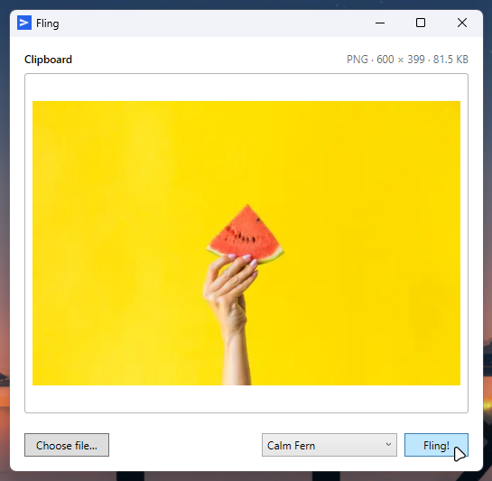

# Fling - Paste on Phone

A lightweight tool for sending clipboard content from a Windows PC to an Android
phone over the local network. Take a screenshot, copy some text, or grab an image,
and it arrives on your phone as a notification, ready to paste.

## How it works

The PC sends content over HTTP to the phone, which runs a foreground service with an
embedded HTTP server. Pair once, then it just works. Auto-discovery finds your phone
on any network without re-pairing.

This is a **clipboard tool**, not a file-sharing app. Content goes to the phone's
clipboard, not to storage. Notifications auto-expire. No cloud, no relay - local
network only.

## Components

| Component | Stack | Directory |
|-----------|-------|-----------|
| [Tray app](gui/README.md) | .NET 8, WPF, single-file exe | `gui/` |
| [CLI tool](cli/README.md) | .NET 8, C#, single-file exe | `cli/` |
| [Android app](android/README.md) | Kotlin, Jetpack Compose, Ktor | `android/` |

The tray app and the CLI are two front-ends over the same shared libraries. Neither
requires the other, and both read the same paired devices and settings — install
whichever suits you, or both. Each releases separately, so their version numbers do
not line up.

## Quick start

1. Install the Fling app on your Android phone and start the service.

**With the tray app:** run `FlingTray.exe`, pick your phone from the Device manager,
approve the request on the phone. After that, copy something and run it again — what
you copied is already staged, so press Enter.

**With the CLI:**

    fling pair --discover
    fling send --clipboard --all
    fling send --image screenshot.png --all
    fling send --text "hello" --device "Pixel"

Either way, tap the notification on your phone to copy it to the clipboard.

## Supported content

| Type | MIME | Notes |
|------|------|-------|
| Plain text | `text/plain` | GZip compressed in transit. Preferred whenever the clipboard offers it. |
| Rich text | `text/html` | GZip compressed in transit. Only sent when the source offers no plain-text alternative. |
| Image | `image/png` | Converted to PNG before sending |

## Protocol

HTTP POST from PC to phone over local network. Default port: **7291**. Auth via
shared API key exchanged during pairing. Auto-discovery via UDP broadcast on port
**7290**. See [docs/DESIGN.md](docs/DESIGN.md) for the full protocol specification.

## License

[MIT](LICENSE) © 2026 David F Dev.
